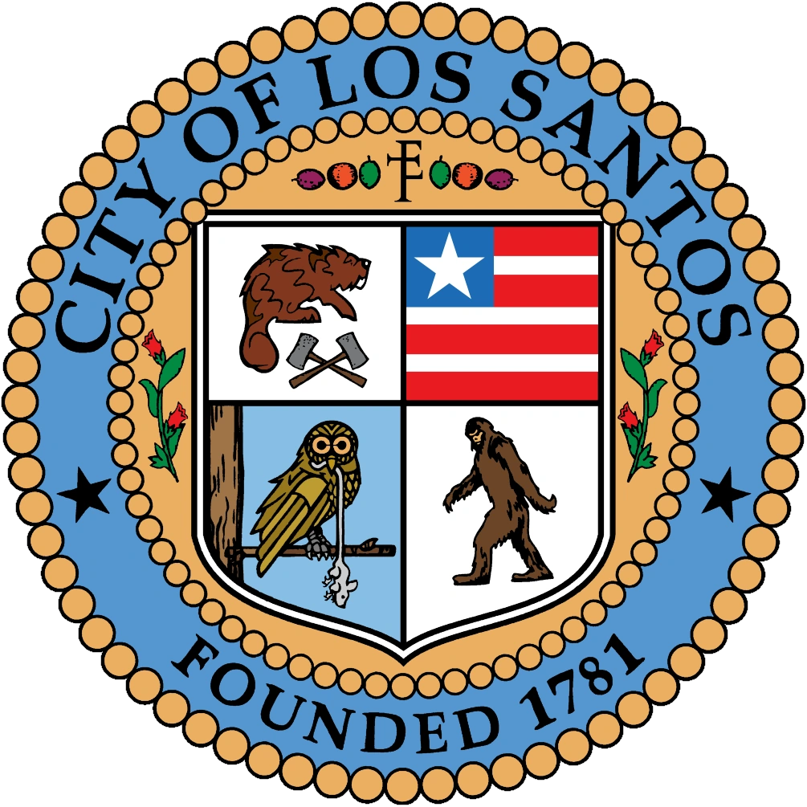

# 📓 Constitución  del Estado de San Andreas

<figure><figcaption></figcaption></figure>

## <mark style="color:yellow;">**Preámbulo**</mark>

> Nosotros, el Pueblo del Estado de San Andreas, con el propósito de formar una comunidad más unida, garantizar la justicia, preservar la paz interna, proveer la defensa común, promover el bienestar general y asegurar los beneficios de la libertad para nosotros y las generaciones futuras, promulgamos y establecemos esta Constitución como fundamento de nuestra sociedad.

***

## <mark style="color:yellow;">**TÍTULO I - Declaración de Derechos (Enmiendas)**</mark> 

_**Enmienda 1.**_ Toda persona es por naturaleza libre e independiente y posee derechos inalienables, como la vida, la libertad, la propiedad, la seguridad y la privacidad. Las autoridades garantizarán estos derechos.

_**Enmienda 2.**_ El pueblo tiene derecho a expresar sus ideas, reunirse pacíficamente y solicitar al gobierno la resolución de quejas para el bien común.

_**Enmienda 3.**_ La libertad de religión está garantizada, prohibiéndose la discriminación. Sin embargo, los actos contrarios a la paz o la seguridad no están protegidos.

_**Enmienda 4.**_ La esclavitud y la servidumbre involuntaria están prohibidas, salvo como castigo por un delito.

_**Enmienda 5.**_ Ninguna persona podrá ser privada de su vida, libertad o propiedad sin el debido proceso legal, ni se le negará la igualdad ante la ley.

_**Enmienda 6.**_ No se concederán privilegios o inmunidades a una clase de ciudadanos que no sean extendidos a todos en igualdad de condiciones.

_**Enmienda 7.**_ El matrimonio entre personas de cualquier género es válido, prohibiéndose la poligamia. Los matrimonios deben formalizarse ante un juez, en una iglesia o ante un funcionario público.

_**Enmienda 8.**_ Ninguna persona será descalificada para ingresar a un empleo o negocio por razones de género, raza, credo, color u origen.

_**Enmienda 9.**_ Ninguna ley puede suspender el derecho al hábeas corpus, salvo en casos de rebelión o invasión que lo justifiquen.

_**Enmienda 10.**_ No se impondrán castigos crueles ni se infligirán multas excesivas.

_**Enmienda 11.**_ La traición contra el Estado incluye actos de guerra contra este, apoyo a enemigos o brindarles ayuda.

_**Enmienda 12.**_ Los no ciudadanos tienen los mismos derechos de propiedad que los ciudadanos del Estado.

_**Enmienda 13.**_ Ningún ciudadano puede ocultar su rostro en público con máscaras o prendas que dificulten su identificación.

_**Enmienda 14.**_ La mayoría de edad en el Estado de San Andreas se alcanza a los 18 años.

_**Enmienda 15.**_ El derecho a huelga es reconocido, pero debe notificarse previamente al ayuntamiento y a las SASF. Huelgas no autorizadas serán consideradas ilegales.

_**Enmienda 16.**_ Todas las personas tienen derecho a reunirse pacíficamente sin necesidad de autorización previa.

_**Enmienda 17.**_ Si una persona permanece encarcelada más allá de su sentencia sin motivo justificado, podrá exigir indemnización.

_**Enmienda 18.**_ Toda persona detenida tiene derecho a ser informada de sus derechos y motivos de detención en un lenguaje claro. La negación de estos derechos invalidará la detención.

_**Enmienda 19.**_ Toda propiedad privada será protegida de registros o incautaciones irrazonables. Solo se permitirá mediante orden judicial o en caso de delito flagrante.

_**Enmienda 20.**_ Se reconoce el derecho de asociación, siempre y cuando no se utilicen medios o fines tipificados como delito.

_**Enmienda 21.**_ Todos los ciudadanos tienen derecho a la protección de la salud, siendo obligación del gobierno tutelar y organizar la sanidad pública.

_**Enmienda 22.**_ Ningún ciudadano americano será privado de su nacionalidad.

_**Enmienda 23.**_ Las condenas menores a 5 meses se cumplirán en calabozos locales, mientras que las mayores a 14 meses se ejecutarán en prisiones estatales.

_**Enmienda 24.**_ Todos los delitos están recogidos en el Código Penal del Estado de San Andreas.

_**Enmienda 25.**_ Los derechos enumerados en esta Constitución no deben interpretarse como una negación o menosprecio de otros derechos pertenecientes al pueblo.

***

## <mark style="color:yellow;">**TÍTULO II - Estado de San Andreas**</mark> 

**Artículo 1.** El Estado de San Andreas forma parte inseparable de los Estados Unidos de América, manteniendo los principios y valores de la nación.

**Artículo 2.** El gobierno del Estado se organiza en tres poderes: legislativo, ejecutivo y judicial, los cuales se ejercerán de manera independiente, salvo en los casos previstos por esta Constitución.

**Artículo 3.** Cualquier demanda contra el Estado se llevará a cabo conforme a la legislación vigente y en los tribunales designados.

**Artículo 4.** El inglés es el idioma oficial del Estado de San Andreas y se utilizará en todos los actos públicos y administrativos.

***

## <mark style="color:yellow;">**TÍTULO III - Poder Ejecutivo**</mark> 

**Artículo 1.** La autoridad ejecutiva suprema del Estado reside en el Alcalde, quien velará por el cumplimiento fiel de la ley.

**Artículo 2.** El Alcalde podrá solicitar información a las agencias y empleados del gobierno sobre el desempeño de sus funciones y deberes.

***

## <mark style="color:yellow;">**TÍTULO IV - Oficiales Públicos y Empleados**</mark> 

**Artículo 1.**\
(a) El servicio civil incluye a todos los funcionarios y empleados del Estado, excepto en los casos en que esta Constitución disponga lo contrario.\
(b) Los nombramientos y promociones en el servicio civil serán realizados mediante un sistema basado en el mérito, determinado por exámenes competitivos

***

## <mark style="color:yellow;">**TÍTULO V - Policía Federal y Estatal, Privación de Libertad y Justificación de Cacheos**</mark> 

**Artículo 1.** La Policía Federal (FIB) y la Policía Estatal (SAPD) son responsables de garantizar el cumplimiento de la ley y el orden en el Estado de San Andreas.

**Artículo 2.** La detención preventiva no podrá exceder el tiempo estrictamente necesario para completar las investigaciones pertinentes, con un máximo de 15 meses. En casos de fuerza mayor, este periodo podrá extenderse únicamente para no comprometer operativos o investigaciones en curso.

**Artículo 3.** La prisión provisional deberá ser ordenada por un juez con justificación suficiente y no podrá exceder una duración de 120 meses.

**Artículo 4.** Las autoridades deberán mantener un respeto mutuo hacia los ciudadanos. Todo ciudadano tiene derecho a solicitar la identificación del agente en caso de privación de derechos. Los agentes podrán detener a cualquier persona que obstaculice su labor o no respete su autoridad.

**Artículo 5.** La policía podrá proceder a la detención inmediata sin previo aviso en los siguientes casos:\
(a) Existencia de una orden judicial pendiente.\
(b) En caso de flagrante delito.\
(c) Refugio del sospechoso en una propiedad privada durante una persecución.\
(d) Activación de una Alerta Táctica de Nivel II.

**Artículo 6.** No se considerarán detenciones las siguientes acciones:\
(a) Registro corporal.\
(b) Control de tráfico.\
(c) Detención preventiva conforme al Artículo 2 de este título.\
(d) Identificación de personas.

**Artículo 7.** **Derechos del detenido:**\
Toda persona detenida tendrá los siguientes derechos, que deberán ser comunicados de manera clara antes o durante su traslado. Si no se cumplen estas condiciones, el detenido podrá solicitar un hábeas corpus, obligando al funcionario a liberarlo y a aplicar las sanciones pertinentes:

1. Derecho a guardar silencio y no declarar contra sí mismo.
2. Derecho a contar con la presencia de un abogado, salvo en caso de flagrante delito. En caso de no poder costearse uno, el Estado le asignará uno de oficio.

El detenido deberá ser informado de los delitos de los que se le acusan tras su procesado.

**Artículo 8.** Solo el detenido o su abogado podrán solicitar un hábeas corpus.

**Artículo 9.** La policía podrá realizar identificaciones sin restricción en los siguientes casos:\
(a) Existencia de indicios razonables de participación en un delito.\
(b) Investigación activa para esclarecer un delito.\
(c) Ocultación del rostro que dificulte la identificación.\
(d) Negativa a identificarse, lo que podrá llevar al traslado a dependencias policiales.

**Artículo 10.** Las autoridades podrán restringir el acceso a vías públicas estableciendo cordones de seguridad cuando la paz social esté en riesgo o existan indicios razonables de peligro.

**Artículo 11.** Los cacheos personales o vehiculares estarán justificados en los siguientes supuestos:

1. Conducir bajo los efectos de sustancias ilegales o alcohol.
2. Porte de armas ilegales.
3. Actos de agresión.
4. Historial delictivo relacionado con tráfico de drogas o armas.
5. Ocultación del rostro en zonas públicas.
6. Presencia en el lugar de un delito reciente para colaborar con la investigación.

**Artículo 12.** Los agentes policiales cuentan con presunción de veracidad en el ejercicio de sus funciones.

**Artículo 13.** La retención de un ciudadano por parte de la policía no podrá exceder los 30 minutos.

***

## <mark style="color:yellow;">**TÍTULO VI - Medio Ambiente y Social**</mark> 

**Artículo 1.** Las siguientes especies están declaradas protegidas en el Estado de San Andreas: pumas, coyotes, ballenas, tiburones, tortugas y orcas. Cualquier acto intencionado contra la vida de estas especies será sancionado conforme al Capítulo X del Código Penal.

**Artículo 2.** El consumo de bebidas alcohólicas en la vía pública será legal únicamente si el contenido de alcohol no supera el 0,01%. Cualquier infracción estará sujeta a sanciones administrativas.

***

## <mark style="color:yellow;">**TÍTULO VII - Intimidad, Honor, Propia Imagen y Protección de Datos**</mark> 

**Artículo 1.** Los derechos al honor, la intimidad personal y familiar tienen carácter fundamental. Estos derechos constituyen un límite a las libertades de expresión en cualquier medio de comunicación público o privado.

**Artículo 2.** Los menores de edad no tienen potestad para ejercer plenamente sus derechos de intimidad y honor. Estas facultades recaerán en sus tutores legales o progenitores.

**Artículo 3.** La prensa tiene plena libertad para opinar sobre temas económicos, políticos, sociales y culturales, siempre que se respete lo dispuesto en el presente título.

**Artículo 4.** Los ciudadanos tienen derecho a grabar o fotografiar a funcionarios públicos siempre que:

1. No se realicen de forma subrepticia.
2. No constituyan un acto delictivo.
3. No sean utilizadas para difamación ni distribuidas públicamente sin autorización.
4. No interfieran en el ejercicio de sus funciones.

**Artículo 5.** Un ciudadano solo perderá sus derechos de intimidad, honor y propia imagen si se encuentra bajo búsqueda y captura. En estos casos, las autoridades podrán publicar fotografías del prófugo para facilitar su localización.

***

## <mark style="color:yellow;">**TÍTULO VIII - Ley de Tráfico**</mark> 

**Artículo 1.** La edad mínima para obtener el permiso de conducción en el Estado de San Andreas es de 16 años.

**Artículo 2.** Las velocidades máximas permitidas en las distintas vías son las siguientes:

1. Autopistas y autovías: 140 km/h.
2. Carreteras secundarias: 100 km/h.
3. Vías urbanas e interurbanas: 80 km/h.
4. Zonas residenciales: 50 km/h.

**Artículo 3.** Los ciudadanos están obligados a pagar sus multas en cualquier comisaría del Estado. El incumplimiento podrá acarrear sanciones adicionales.

**Artículo 4.** Los vehículos podrán ser confiscados en los siguientes casos:

1. Uso para transporte de sustancias u objetos ilegales.
2. Empleo como arma en la comisión de un delito.
3. Uso para huir de las autoridades; si el conductor no es detenido, el propietario será puesto bajo búsqueda y captura.

**Artículo 5.** Todos los vehículos deben circular con piezas homologadas. Se consideran no homologadas las siguientes:

1. Óxido nitroso.
2. Faros delanteros de colores no reglamentarios.
3. Piezas no seguras o improvisadas (cartón, entre otros).
4. Cristales delanteros tintados.

***

## <mark style="color:yellow;">**TÍTULO IX - Ley Laboral**</mark> 

**Artículo 1.** La legislatura tiene la facultad de establecer salarios mínimos y velar por el bienestar general de los empleados. Para estos fines, se podrá delegar en una comisión con poderes legislativos, ejecutivos y judiciales.

**Artículo 2.** Todos los ciudadanos del Estado de San Andreas tienen derecho a acceder a un empleo digno, sin discriminación por motivos de etnia, religión, género o cualquier otra condición personal.

**Artículo 3.** Las relaciones laborales en el Estado estarán reguladas por la legislación comercial vigente, garantizando derechos equitativos para empleadores y empleados.

**Artículo 4.** El Estado organizará programas de reinserción laboral para personas que hayan cumplido condenas, con el objetivo de facilitar su integración en la sociedad.

***

## <mark style="color:yellow;">**TÍTULO X - Estado de Protección de Seguridad Estatal**</mark> 

**Artículo 1.** El Estado de Protección de Seguridad Estatal se estructura en los siguientes niveles de alerta:

**Alerta Táctica Nivel 1.**

1. Este nivel es el plan inicial de movilización del SAPD ante incidentes inusuales.
2. Permite redistribuir el personal en servicio para atender un evento significativo.
3. Autoriza a los agentes a realizar identificaciones cuando sea necesario.
4. La alerta puede ser activada por el Comisionado del SAPD.
5. Los agentes podrán portar armas de largo calibre si la Jefatura lo aprueba.

**Alerta Táctica Nivel 2.**

1. Se activa si la Alerta Táctica Nivel 1 no logra controlar la situación.
2. Todos los agentes deberán portar armas de largo calibre y chalecos pesados.
3. Las patrullas se realizarán en formaciones ADAM con cobertura blindada.
4. Los agentes tendrán potestad para cerrar negocios bajo autorización del Watch Commander de la zona.
5. Podrá declararse un toque de queda con la aprobación del Alcalde y el Comisionado en conjunto.
6. Esta alerta solo puede ser activada por la Jefatura del SAPD con autorización del Alcalde.

***

## <mark style="color:yellow;">**TÍTULO XI - Ley RICO (Ley de Chantaje Civil, Influencia y Organizaciones Criminales)**</mark> 

**Artículo 1.** La Ley RICO regula las acciones contra el crimen organizado, permitiendo sanciones civiles y penales por actividades delictivas realizadas en el marco de una organización o empresa criminal.

**Artículo 2.** Se considera "empresa" a cualquier persona física, entidad comercial, asociación, sindicato o grupo de individuos.

**Artículo 3.** Los actos sancionados por la Ley RICO incluyen, pero no se limitan a:\
(a) Violaciones de leyes contra juegos de azar, homicidios, secuestros, extorsión, incendios, robos y sobornos.\
(b) Tráfico de materiales ilegales o sustancias controladas (considerado tráfico a partir de 15 unidades).\
(c) Lavado de dinero y delitos conexos.\
(d) Actos de terrorismo o esclavitud.\
(e) Malversación de fondos sindicales, fraude bancario o de valores.

**Artículo 4.** La violación de la Ley RICO, tras una denuncia fundada y aprobación judicial, puede conllevar la pena capital o sanciones equivalentes según lo dispuesto por el tribunal.

***

## <mark style="color:yellow;">**TÍTULO XII - Cámaras de Videovigilancia**</mark> 

**Artículo 1.** La Policía Federal y Estatal está autorizada a realizar grabaciones mediante cámaras instaladas en vehículos policiales o en ubicaciones estratégicas, siempre que sea necesario para una investigación.

**Artículo 2.** Las cámaras de videovigilancia deben respetar la intimidad de las personas y no podrán grabar áreas sensibles como baños, vestuarios o viviendas particulares, salvo en situaciones justificadas.

**Artículo 3.** Las grabaciones realizadas serán almacenadas por un periodo máximo de cinco días, tras el cual deberán ser eliminadas, salvo que sean requeridas como evidencia en un procedimiento judicial.

***

## <mark style="color:yellow;">**TÍTULO XIII - Regulación de Armas**</mark> 

**Artículo 1.** Las armas de fuego son legales en el Estado de San Andreas, bajo regulación estricta y previa obtención de un permiso expedido por el SAPD.

**Artículo 2.** Las armas autorizadas deberán ser usadas únicamente para defensa personal en domicilios, propiedades privadas o lugares de trabajo.

**Artículo 3.** El uso fraudulento de licencias de armas, la transferencia de armas legales con número de serie, o su falsificación, será severamente penado por la ley.

**Artículo 4.** El mal uso de las armas de fuego conllevará la retirada inmediata de la licencia y sanciones adicionales.

**Artículo 5.** Cualquier arma legal utilizada para cometer un acto ilegal será considerada automáticamente como un arma ilegal.

***

## <mark style="color:yellow;">**Glosario de términos técnicos**</mark> 

1. **Alerta Táctica:** Protocolo de seguridad que permite a las fuerzas del orden redistribuir recursos y personal para enfrentar situaciones excepcionales.
2. **Detención preventiva:** Retención temporal de un ciudadano por parte de las autoridades mientras se investigan los hechos relacionados con un posible delito.
3. **Habeas corpus:** Procedimiento legal que garantiza que una persona detenida pueda comparecer ante un juez para verificar la legalidad de su detención.
4. **Número de serie de armas:** Identificador único grabado en las armas de fuego para registrar su propiedad y legalidad.
5. **Presunción de veracidad:** Principio jurídico que establece que el testimonio de un funcionario público, en el ejercicio de sus funciones, se presume cierto salvo prueba en contrario.
6. **Registro corporal:** Inspección superficial de una persona realizada por las autoridades para buscar objetos ilegales o evidencia.
7. **SAPD:** Siglas del "San Andreas Police Department", entidad policial que opera dentro del Estado de San Andreas y que incluye a los siguientes departamentos: Los Santos Police Department (LSPD), Blaine County Sheriff Office (BCSO) y San Andreas Highway Patrol (SAHP)
8. **Subrepticio:** Acto realizado de manera oculta o disimulada, a menudo con la intención de evadir la atención.
9. **Videovigilancia:** Sistema de grabación mediante cámaras para supervisar áreas públicas o privadas con fines de seguridad.
